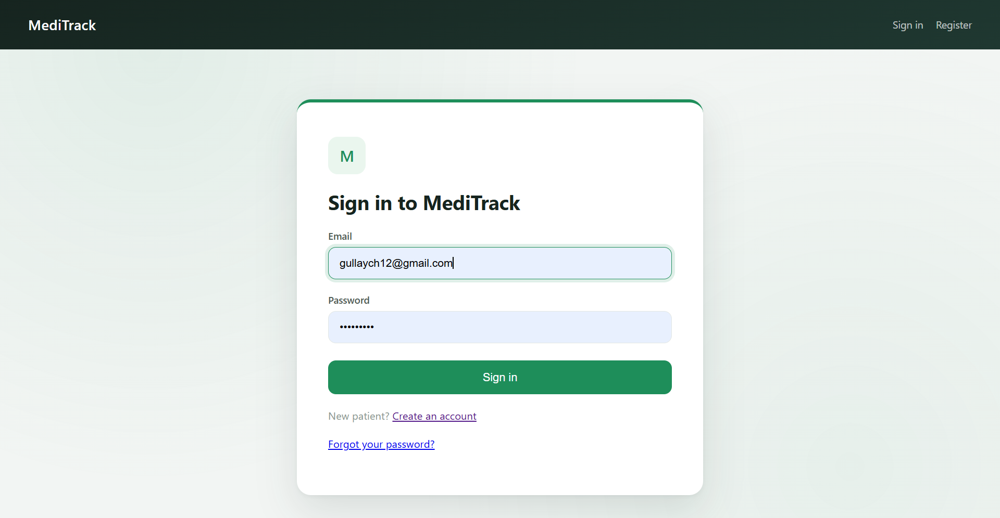
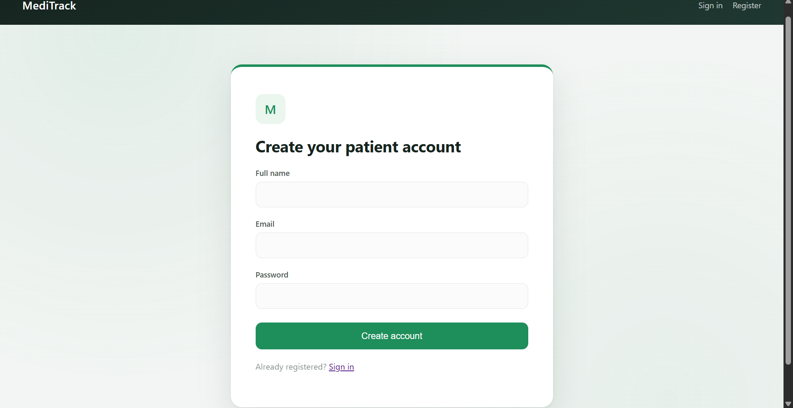
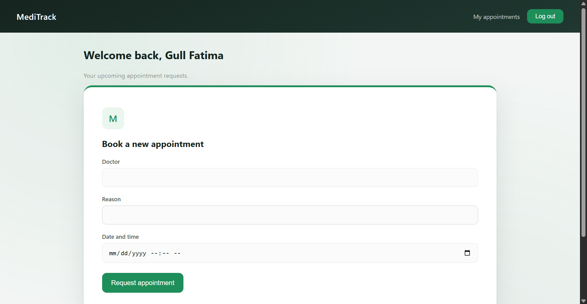
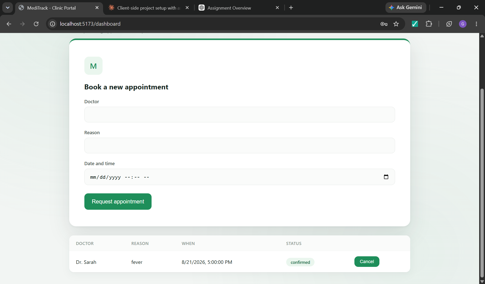
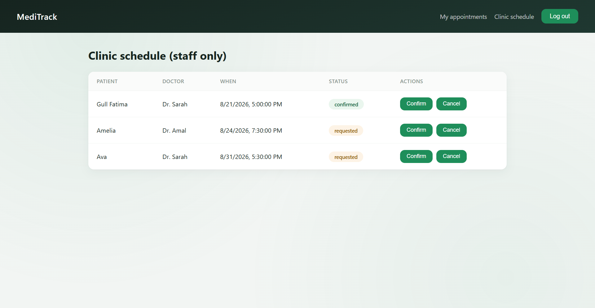
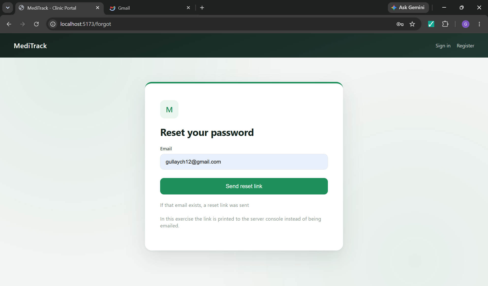
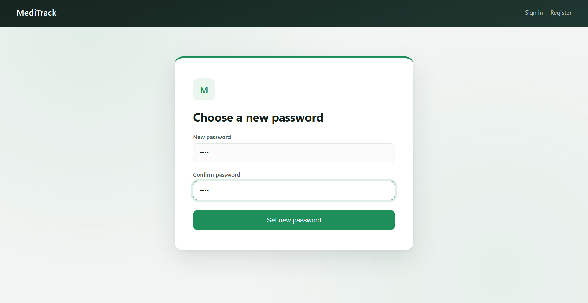

# 🏥 MediTrack

**A Clinic Appointment Portal with Secure Login, Role-Based Access, and Real-Time Status Tracking**

---

## 📖 About

MediTrack replaces Al-Shifa Clinic's paper-based appointment system with a clean, secure web portal. Patients register, book appointments, and track their status in real time — while clinic staff manage the full schedule from a dedicated dashboard.

The project was built around four core rules:

| Rule | Implementation |
|------|----------------|
| A patient must log in first | JWT-based auth with a session that survives page refresh |
| A patient sees only their own appointments | Every query is filtered by the owner extracted from the token |
| Staff see all appointments and can confirm them | Server-side role check (`patient` vs `staff`) |
| A stolen script must not steal a session | Token is stored in an `HttpOnly` cookie — never in JavaScript or Redux |

---

## 🛠️ Tech Stack

- **Frontend:** React + Vite, Redux Toolkit
- **Backend:** Node.js, Express
- **Database:** MongoDB (Mongoose)
- **Auth:** JWT stored in HttpOnly cookies, bcrypt password hashing
- **Security:** Helmet, express-rate-limit, express-mongo-sanitize

---

## ✨ Features

- 🔐 Secure registration & login with hashed passwords
- 🍪 Session persistence via HttpOnly cookies (no token exposure to JS)
- 📅 Patients can book, view, and cancel their own appointments
- 👩‍⚕️ Staff dashboard to view **every** patient's appointments and confirm/cancel them
- 🚫 Strict ownership checks — a patient can never access another patient's data
- 🔁 Password reset flow (dev mode: link is printed to the server console)
- 🎨 Custom "Warm Clinic" premium UI theme with smooth hover/focus micro-interactions

---

## 📸 Screenshots

### Sign in


### Create an account


### Patient dashboard



### Staff clinic schedule


### Password reset flow



---

## 🚀 Getting Started

### 1. Clone the repo
```bash
git clone https://github.com/gullFatyma/meditrack-mernStack.git
cd meditrack-mernStack/meditrack
```

### 2. Set up the server
```bash
cd server
npm install
cp .env.example .env
```
Fill in your `.env`:
```
PORT=5000
MONGO_URI=your_mongodb_connection_string
JWT_SECRET=a_long_random_string_at_least_32_chars
CLIENT_URL=http://localhost:5173
NODE_ENV=development
```
```bash
npm run dev
```

### 3. Set up the client
```bash
cd ../client
npm install
npm run dev
```

### 4. Open the app
Visit **http://localhost:5173**

---

## 👥 Roles

MediTrack has exactly two roles:

- **`patient`** (default on registration)
- **`staff`** (manually assigned by editing a user's `role` field in MongoDB — there is no staff sign-up)

To promote an account to staff:
```js
db.users.updateOne(
  { email: "someone@example.com" },
  { $set: { role: "staff" } }
)
```
> ⚠️ The user must log out and log back in afterward — the role is baked into the JWT at login time.

---

## 🔒 Security Notes

- Passwords are hashed with `bcrypt` before storage
- JWTs are signed and stored in `HttpOnly`, `SameSite=Lax` cookies — inaccessible to JavaScript
- All appointment routes filter by the authenticated user's ID from the token, never from the request body
- `express-mongo-sanitize` strips NoSQL injection operators from input
- `express-rate-limit` throttles repeated auth requests

---

## 🎯 What This Project Demonstrates

- Authentication vs. Authorization (401 vs. 403)
- Secure session management without exposing tokens to the client
- Redux Toolkit's `createAsyncThunk` for clean async state handling
- MongoDB ownership patterns for multi-tenant data isolation
- Role-based route protection on both client and server
